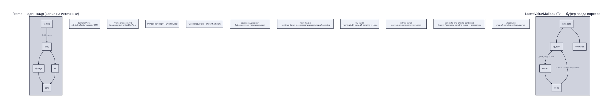
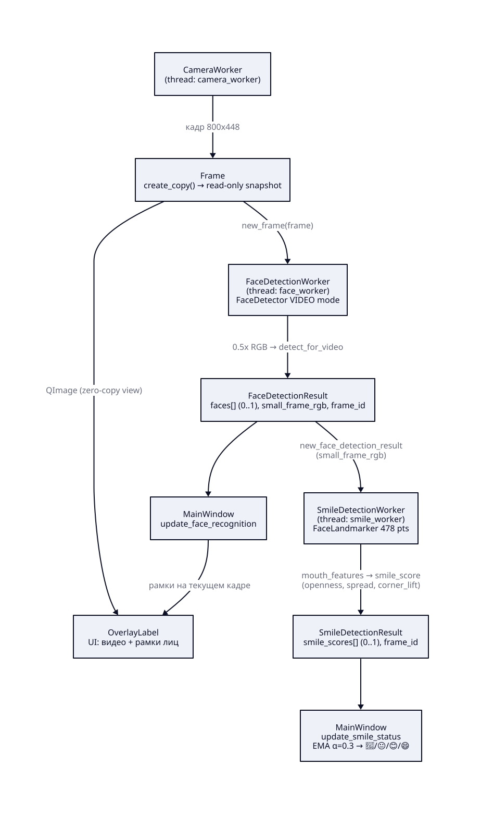
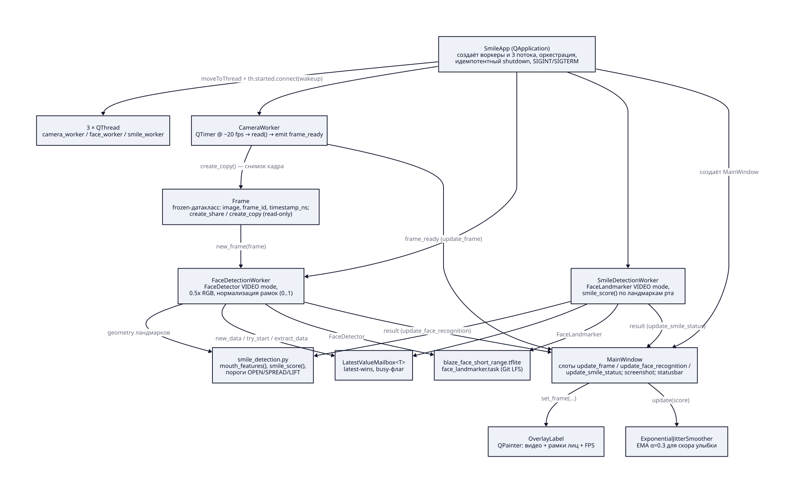
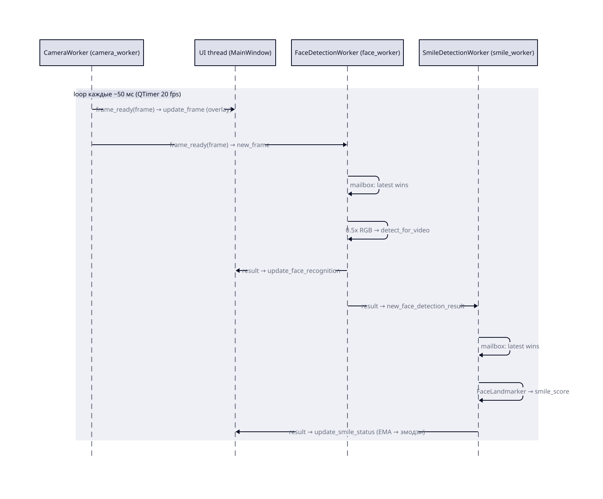

# Архитектура smile: как это работает в реальном времени

Приложение — асинхронный realtime-конвейер из трёх потоков-воркеров
(`camera_worker` → `face_worker` → `smile_worker`), которыми оркеструет
`SmileApp` (подкласс `QApplication`). Каждый воркер живёт в своём `QThread`,
данные между потоками едут через сигналы Qt, а внутри воркера — через
однослотовый `LatestValueMailbox` с семантикой «последний победил»
(latest-wins).

Диаграммы ниже в `docs/generated/`, исходники D2 — рядом в `docs/*.d2`
(пересобираются через `just build` в `docs/`).

## 1. Буфер ввода: как живёт кадр и mailbox

Два ключевых механизма:

- **Кадр — копия на источнике.** `CameraWorker` читает кадр из OpenCV и
  сразу делает `Frame.create_copy()`: приватная `read-only` копия
  (`image.copy() + writeable=False`). Дальше эту копию без риска читают и
  QImage (UI), и CV-воркеры — буфер камеры больше никто не перезаписывает,
  поэтому рваных кадров нет. Внутри конвейера для уже созданных копий
  используется дешёвый `Frame.create_share()` (тот же буфер, тоже read-only).

- **Mailbox — однослотовый буфер ввода.** `LatestValueMailbox<T>` хранит
  ровно один `pending_data` и флаг `busy`:

  - `new_data(x)` — просто кладёт значение в слот, **перезаписывая** старое
    (если потребитель не успел — старое значение теряется, это и есть
    latest-wins);
  - `try_start()` — начинает обработку, только если `running && !busy &&
    pending != None`; иначе ничего не делает и ждёт следующего `new_data`;
  - `extract_data()` — забирает значение и очищает слот;
  - `complete_and_should_continue()` — снимает `busy`; если за время
    обработки пришёл новый pending, тут же запускает следующий проход.

  Следствие: воркер никогда не «складирует» кадры — буфер ввода ведёт себя
  как одна свежая ячейка, а не очередь.

## 2. Конвейер распознавания

- `CameraWorker` захватывает кадры (800×448 @ ~20 fps) и через сигнал
  `frame_ready` отправляет `Frame` **и в UI, и в face-воркер**.
- `FaceDetectionWorker` уменьшает кадр вдвое (`0.5x`, RGB) и гонит через
  MediaPipe `FaceDetector` (`RunningMode.VIDEO`). Результат —
  `FaceDetectionResult`: нормализованные рамки лиц (0..1) + уменьшенный
  RGB-кадр (`small_frame_rgb`).
- `SmileDetectionWorker` получает результат face-воркера, прогоняет
  `small_frame_rgb` через MediaPipe `FaceLandmarker` (478 точек) и считает
  скор улыбки функцией `smile_score()` по геометрии рта:

  - `openness` — высота рта / ширина рта;
  - `spread` — ширина рта / межглазное расстояние;
  - `corner_lift` — подъём уголков рта относительно линии губ (гейт).

  Итоговый скор `max(spread_score, open_score * lift_gate)` ∈ [0, 1],
  пороги откалиброваны на реальных данных камеры.

## 3. Классы и их ответственность

| Класс / модуль | Что делает |
|---|---|
| `SmileApp` | Оркестрация: создаёт воркеры и 3 потока, разводит сигналы, идемпотентный `shutdown()`, выход по SIGINT/SIGTERM |
| `QThread` ×3 | По одному рабочему потоку на воркер |
| `CameraWorker` | Захват камеры: `QTimer` → `read()` → `Frame` |
| `Frame` | Неизменяемый снимок кадра (`create_share` / `create_copy`) |
| `FaceDetectionWorker` | `FaceDetector` (VIDEO mode), нормализация рамок, `small_frame_rgb` |
| `SmileDetectionWorker` | `FaceLandmarker` (VIDEO mode), вызывает `smile_score()` |
| `smile_detection.py` | Чистая логика скоринга: `mouth_features()`, `smile_score()`, пороги `OPEN`/`SPREAD`/`LIFT` |
| `LatestValueMailbox<T>` | Однослотовый latest-wins буфер ввода |
| `MainWindow` | Слоты `update_frame` / `update_face_recognition` / `update_smile_status`, скриншот, статусбар |
| `OverlayLabel` | `QPainter`: видео + рамки лиц |
| `ExponentialJitterSmoother` | EMA-сглаживание скора улыбки (α=0.3) |
| Модели (Git LFS) | `blaze_face_short_range.tflite`, `face_landmarker.task` |

## 4. Realtime-цикл

Один «тик» живого приложения:

1. `CameraWorker` по таймеру читает кадр и эмитит `frame_ready` — сигнал
   уходит одновременно в UI-поток (рендер) и в face-воркер (детекция).
2. Face-воркер кладёт кадр в свой mailbox и, если свободен, через
   `QTimer.singleShot(0)` сразу начинает обработку; если занят — кадр
   просто перезапишет pending (старый отбрасывается).
3. Результат детекции лица уходит в UI (обновление рамок) и в smile-воркер.
4. Smile-воркер по той же схеме mailbox обрабатывает `small_frame_rgb`,
   считает скоры и шлёт `SmileDetectionResult` в UI.
5. UI-поток `update_smile_status` сглаживает лучший скор EMA (α=0.3) и
   показывает эмодзи: `🖖` нет лица / `😐` нейтрально / `😊` улыбка / `😄`
   широкая улыбка.

**Почему это realtime:** латентность важнее полноты. Воркер всегда
обрабатывает только самый свежий вход, устаревшие кадры намеренно
сбрасываются, захват камеры никогда не блокируется детекцией, а весь Qt
рендеринг выполняется строго в главном UI-потоке.